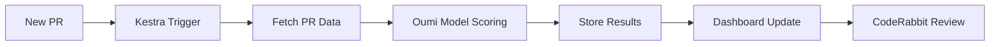
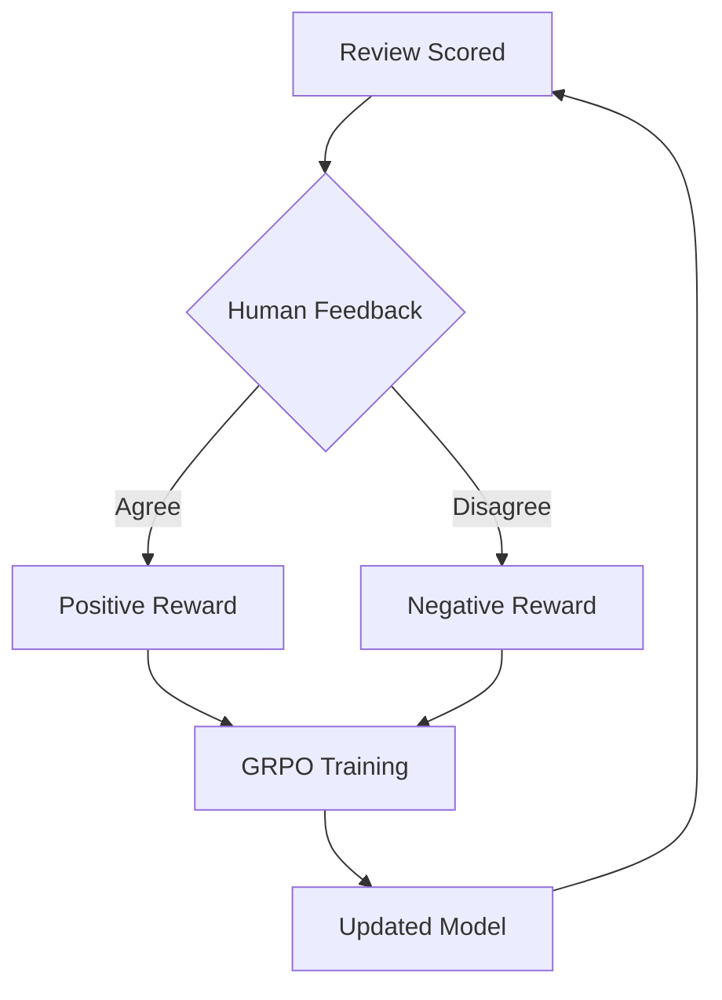

# 🔥 Review-Forge

> **Forging better code reviews through AI** - An intelligent code review quality scorer with learning feedback loop

[](https://vercel.com/new/clone?repository-url=https://github.com/yourusername/review-forge)
[](https://coderabbit.ai)

## 🎯 Overview

Review-Forge is an AI-powered platform that revolutionizes code review quality by combining five powerful technologies:

- **🤖 Cline CLI** - Autonomous AI coding agent for automated analysis
- **🔄 Kestra** - Workflow orchestration with AI agents for data summarization
- **🧠 Oumi** - Reinforcement learning fine-tuned models for review scoring
- **🚀 Vercel** - Modern dashboard deployment
- **🐰 CodeRabbit** - Automated PR reviews and quality suggestions

## ✨ Features

### 1. Review Quality Scorer
- AI-powered scoring of PR reviews (0-100)
- Multi-dimensional analysis: clarity, completeness, actionability
- Historical tracking and trend analysis

### 2. Code Health Dashboard
- Real-time metrics visualization
- Team performance insights
- Code complexity trends
- Review turnaround time analytics

### 3. Review Learning/Feedback Loop
- Reinforcement learning from human feedback
- Continuously improving review suggestions
- Personalized recommendations per developer

### 4. Code Auto-Fix
- AI-generated fix suggestions
- One-click apply via Cline CLI
- Integration with existing CI/CD pipelines

## 🏗️ Architecture

```
┌─────────────────────────────────────────────────────────────────┐
│                    REVIEW-FORGE ARCHITECTURE                     │
├─────────────────────────────────────────────────────────────────┤
│                                                                  │
│  ┌──────────────┐     ┌──────────────┐     ┌──────────────────┐ │
│  │   Cline CLI  │────▶│    Kestra    │────▶│  Oumi RL Model   │ │
│  │  (Commands)  │     │ (Orchestrate)│     │ (Score & Learn)  │ │
│  └──────────────┘     └──────────────┘     └──────────────────┘ │
│         │                    │                      │           │
│         ▼                    ▼                      ▼           │
│  ┌──────────────────────────────────────────────────────────────┐
│  │              Next.js Dashboard (Vercel)                      │
│  │  • Review Quality Scores  • Code Health Metrics              │
│  │  • Learning Feedback Loop • Auto-fix Suggestions             │
│  └──────────────────────────────────────────────────────────────┘
│                              │                                   │
│                              ▼                                   │
│  ┌──────────────────────────────────────────────────────────────┐
│  │              CodeRabbit Integration                          │
│  │  • PR Reviews • Quality Suggestions • Best Practices         │
│  └──────────────────────────────────────────────────────────────┘
│                                                                  │
└─────────────────────────────────────────────────────────────────┘
```

## 🚀 Quick Start

### Prerequisites

- Node.js >= 18.0.0
- Python >= 3.9 (for Oumi)
- Docker (for Kestra)
- GitHub account with API token

### Installation

```bash
# Clone the repository
git clone https://github.com/yourusername/review-forge.git
cd review-forge

# Install dependencies
npm install

# Setup environment variables
cp .env.example .env
# Edit .env with your API keys

# Start the dashboard
npm run dev

# In another terminal, start Kestra
docker-compose up -d kestra
```

### CLI Usage

```bash
# Install CLI globally
npm install -g review-forge-cli

# Analyze a PR
review-forge analyze --pr https://github.com/owner/repo/pull/123

# Get review quality score
review-forge score --repo owner/repo

# Auto-fix issues
review-forge fix --file src/example.ts

# Generate review suggestions
review-forge suggest --pr 123

# Train the model with feedback
review-forge learn --feedback positive --review-id abc123
```

## 📁 Project Structure

```
review-forge/
├── cli/                    # Cline CLI tool
│   ├── src/
│   │   ├── commands/       # CLI commands
│   │   ├── analyzers/      # Code analysis logic
│   │   └── utils/          # Helper utilities
│   └── package.json
├── dashboard/              # Next.js dashboard (Vercel)
│   ├── src/
│   │   ├── app/            # App router pages
│   │   ├── components/     # React components
│   │   └── lib/            # Utilities & API
│   └── package.json
├── kestra/                 # Kestra workflows
│   ├── flows/              # Workflow definitions
│   └── docker-compose.yml
├── oumi/                   # Oumi RL training
│   ├── training/           # Training scripts
│   ├── data/               # Training data
│   └── requirements.txt
├── .coderabbit.yaml        # CodeRabbit configuration
├── .env.example            # Environment template
└── README.md
```

## 🔧 Configuration

### Environment Variables

| Variable | Description | Required |
|----------|-------------|----------|
| `GITHUB_TOKEN` | GitHub API token | Yes |
| `OPENAI_API_KEY` | OpenAI API key (or Together AI) | Yes |
| `TOGETHER_API_KEY` | Together AI API key | Optional |
| `KESTRA_API_URL` | Kestra API endpoint | Yes |
| `DATABASE_URL` | Database connection string | Yes |

### CodeRabbit Setup

CodeRabbit is automatically configured via `.coderabbit.yaml`. It will:
- Review all PRs automatically
- Suggest code improvements
- Check for best practices
- Generate documentation suggestions

## 🧠 How It Works

### 1. PR Analysis Pipeline



### 2. Review Quality Scoring

The Oumi-trained model evaluates reviews based on:
- **Clarity** (0-25): How clear and understandable
- **Completeness** (0-25): Coverage of issues
- **Actionability** (0-25): Specific, actionable feedback
- **Constructiveness** (0-25): Helpful and professional tone

### 3. Learning Loop



## 🛠️ Development

### Running Tests

```bash
# All tests
npm test

# CLI tests
npm test --workspace=cli

# Dashboard tests
npm test --workspace=dashboard
```

### Building for Production

```bash
# Build all
npm run build

# Deploy to Vercel
vercel --prod
```

## 📊 Dashboard Preview

The dashboard provides:
- **Overview**: Key metrics at a glance
- **Reviews**: Detailed review analysis
- **Trends**: Historical data visualization
- **Team**: Per-developer insights
- **Settings**: Configuration management

## 🤝 Contributing

1. Fork the repository
2. Create your feature branch (`git checkout -b feature/amazing-feature`)
3. Commit your changes (`git commit -m 'Add amazing feature'`)
4. Push to the branch (`git push origin feature/amazing-feature`)
5. Open a Pull Request

CodeRabbit will automatically review your PR!

## 📜 License

MIT License - see [LICENSE](LICENSE) for details.

## 🙏 Acknowledgments

Built with:
- [Cline](https://cline.bot) - AI coding assistant
- [Kestra](https://kestra.io) - Workflow orchestration
- [Oumi](https://oumi.ai) - RL fine-tuning
- [Vercel](https://vercel.com) - Deployment platform
- [CodeRabbit](https://coderabbit.ai) - AI code reviews

---

<p align="center">
  <strong>🔥 Review-Forge - Forging better code reviews through AI 🔥</strong>
</p>
